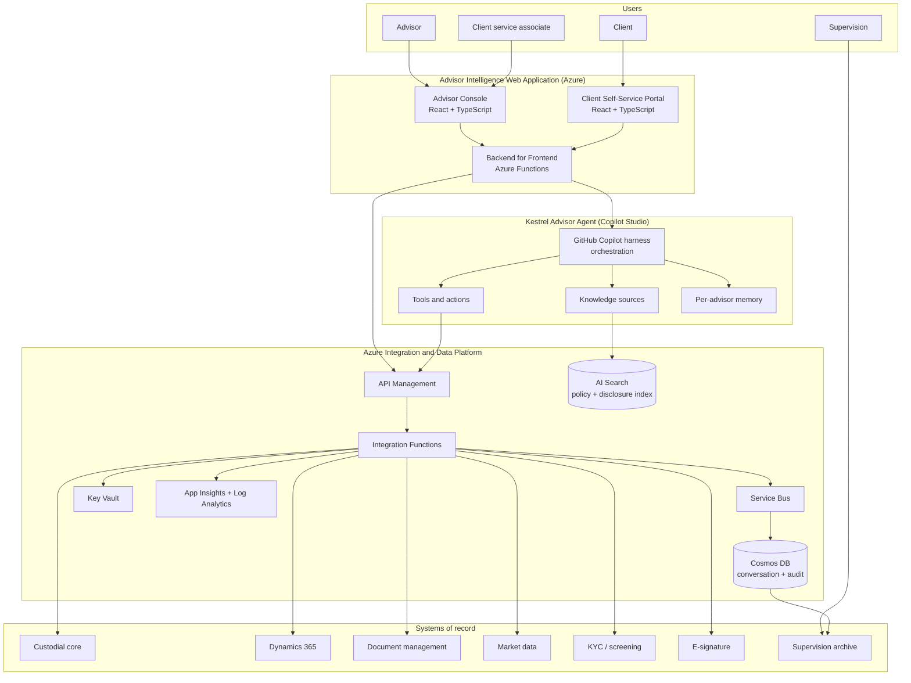

# Kestrel Financial Group — Advisor Intelligence Platform

**Product and Technical Specification**

**Author:** Dewain Robinson
**Document version:** 1.0
**Status:** Approved for estimation
**Classification:** Fictional sample — see notice below

---

> ### ⚠ FICTIONAL SAMPLE
>
> **Kestrel Financial Group does not exist.** Every entity, system name, volume,
> policy, service-level target, and regulatory interpretation in this document
> is invented for the purpose of exercising a build estimator.
>
> Nothing here is regulatory advice. Real financial-services delivery is subject
> to obligations this document only gestures at, and the compliance content
> below is illustrative shape, not guidance. Do not lift it into a real
> programme.

---

## 1. Context

### 1.1 The organization

Kestrel Financial Group is a mid-sized wealth management and private banking
firm. Relevant scale:

| Dimension | Figure |
| --- | --- |
| Client households | 84,000 |
| Assets under management | $61bn |
| Licensed advisors | 1,150 |
| Client service associates | 620 |
| Branch/office locations | 74 across 3 regions |
| Core platform | Third-party custodial core, REST + nightly batch |
| Identity | Microsoft Entra ID, 11,400 internal seats |
| Existing estate | Microsoft 365 E5, Azure landing zone, Dynamics 365 CRM |

### 1.2 The problem

An advisor preparing for a client review currently touches nine systems. A
typical prep takes 40–70 minutes: pulling holdings and performance from the
custodial core, reconciling against the CRM's relationship notes, checking open
service requests, retrieving the client's most recent suitability
questionnaire, finding the current product disclosures for anything being
discussed, and assembling all of it into a review pack.

Client service associates field roughly 31,000 inbound queries a month, of
which an internal sample suggests 55–60% are answerable from information the
firm already holds — balances, transaction history, document requests, standing
instructions — but require the associate to navigate the same nine systems.

### 1.3 Objectives

| # | Objective | Measure |
| --- | --- | --- |
| O1 | Cut advisor review preparation time | 40–70 min → under 15 min for 80% of reviews |
| O2 | Deflect routine client service queries | 45% of eligible inbound volume handled without associate involvement |
| O3 | Improve suitability evidence quality | 100% of advice interactions carry a linked suitability record |
| O4 | Reduce disclosure delivery failures | Zero missed mandatory disclosures on in-scope conversations |
| O5 | Preserve supervisory oversight | 100% of agent-assisted interactions available to supervision within 24h |

### 1.4 Explicit non-objectives

- The agent does not give investment advice or make recommendations.
- The agent does not execute trades, transfers, or any monetary movement.
- The agent does not replace the suitability assessment process; it evidences it.
- No client-facing autonomous conversation in phase 1 (see §12).

---

## 2. Solution overview

Three deliverables, built together, deployed to Microsoft platforms.

| Component | Platform | Notes |
| --- | --- | --- |
| Kestrel Advisor Agent | **Copilot Studio, GitHub Copilot harness** | Authored as agent definition, deployed via ALM |
| Advisor Intelligence Web Application | **Azure** | Advisor console + client portal + BFF |
| Integration and Data Platform | **Azure** | APIM, Functions, Service Bus, Cosmos, AI Search |

---

## 3. Agent specification

### 3.1 Harness and model

| Setting | Value | Rationale |
| --- | --- | --- |
| Harness | GitHub Copilot harness | Deep reasoning over M365 data; evaluation tooling required by §11 |
| Primary model | Reasoning-capable | Multi-step suitability and disclosure logic |
| Orchestration | Harness-managed | Not configurable on this harness |
| Memory | Enabled, per-advisor | Preferences and working context; **never** client PII |
| Response mode | Grounded, citation-required | Every factual claim traceable to a source |

### 3.2 Capability areas

Nine capability areas. Each carries topics, tool bindings, and its own
evaluation set.

| # | Capability | Description | Complexity |
| --- | --- | --- | --- |
| C1 | Client position summary | Holdings, allocation, performance across accounts | High |
| C2 | Transaction enquiry | History, pending items, settlement status | Medium |
| C3 | Review pack assembly | Assemble a compliant client review pack | Very high |
| C4 | Document retrieval and request | Statements, tax documents, agreements | Medium |
| C5 | Suitability record surfacing | Latest questionnaire, gaps, expiry warnings | High |
| C6 | Disclosure orchestration | Determine and deliver mandatory disclosures | Very high |
| C7 | Service request triage | Classify, route, or resolve inbound requests | High |
| C8 | Complaint detection and escalation | Detect complaint language, mandatory escalation | Very high |
| C9 | Market and product context | Product facts, fees, current commentary | Medium |

### 3.3 Tools and actions

Eighteen tools. Each requires a schema, an auth path, error handling, and an
evaluation case.

| Tool | Backing system | Notes |
| --- | --- | --- |
| `get_client_positions` | Custodial core | Multi-account aggregation, as-of dating |
| `get_performance` | Custodial core + market data | Time-weighted return, benchmark comparison |
| `get_transactions` | Custodial core | Pagination, 7-year window |
| `get_pending_activity` | Custodial core | Settlement state machine |
| `get_relationship_summary` | Dynamics 365 | Household structure, related parties |
| `get_service_requests` | Dynamics 365 | Open items, SLA state |
| `create_service_request` | Dynamics 365 | **Write** — requires confirmation |
| `get_suitability_record` | Dynamics 365 | Latest assessment, expiry |
| `flag_suitability_gap` | Dynamics 365 | **Write** — supervisory visibility |
| `search_documents` | Document management | Metadata + content search |
| `request_document_delivery` | Document management | **Write** — audited delivery |
| `get_product_disclosure` | AI Search index | Versioned, effective-dated |
| `determine_required_disclosures` | Rules service (Functions) | Deterministic; agent must not infer |
| `record_disclosure_delivery` | Cosmos + archive | **Write** — regulatory record |
| `get_market_context` | Market data | Delayed quotes only |
| `check_screening_status` | KYC / screening | Read-only, sanctions/PEP state |
| `initiate_esignature` | E-signature | **Write** — requires advisor confirmation |
| `escalate_to_human` | Service Bus → CRM | Mandatory path for C8 |

**Seven write-capable tools.** Each requires a confirmation pattern, an
idempotency key, an audit record, and negative-path evaluation.

### 3.4 Knowledge sources

| Source | Volume | Refresh | Index |
| --- | --- | --- | --- |
| Product disclosures | ~2,400 documents | On publication | Azure AI Search, effective-dated |
| Policy and procedure library | ~1,900 documents | Weekly | Azure AI Search |
| Fee schedules | 340 documents | Quarterly | Azure AI Search |
| Internal FAQ / KB | ~6,000 articles | Continuous | Azure AI Search |
| Regulatory bulletins | ~800 documents | As issued | Azure AI Search, retention-tagged |

Grounding requirement: **no ungrounded factual claims.** A response that cannot
cite a source must decline and offer escalation.

---

## 4. Web application specification

### 4.1 Advisor Console

React + TypeScript, embedded agent surface plus native views.

| Module | Description | Complexity |
| --- | --- | --- |
| W1 | Shell, routing, Entra ID auth, role gating | Medium |
| W2 | Client search and household selector | Medium |
| W3 | Agent conversation surface with citation rendering | High |
| W4 | Position and performance visualisation | High |
| W5 | Review pack builder and preview | Very high |
| W6 | Disclosure tracker and delivery confirmation | High |
| W7 | Suitability status panel | Medium |
| W8 | Service request queue and triage view | High |
| W9 | Document library and request flow | Medium |
| W10 | Audit trail viewer (advisor's own actions) | Medium |
| W11 | Accessibility conformance (WCAG 2.2 AA) | High |
| W12 | Telemetry, feature flags, error boundaries | Medium |

### 4.2 Client Self-Service Portal

Narrower surface, higher assurance.

| Module | Description | Complexity |
| --- | --- | --- |
| P1 | Authentication, step-up for sensitive actions | High |
| P2 | Account overview | Medium |
| P3 | Document centre | Medium |
| P4 | Secure message composition (routed, not agent-answered in phase 1) | High |
| P5 | Disclosure acknowledgement capture | High |

### 4.3 Backend for Frontend

Azure Functions, TypeScript.

| Module | Description | Complexity |
| --- | --- | --- |
| B1 | Session and token brokering | High |
| B2 | Agent invocation and streaming relay | High |
| B3 | Aggregation endpoints for W4/W5 | High |
| B4 | Write-path confirmation orchestration | Very high |
| B5 | Rate limiting, quota, circuit breaking | Medium |

---

## 5. Integration specification

| # | System | Protocol | Direction | Notes |
| --- | --- | --- | --- | --- |
| I1 | Custodial core — positions | REST | Read | 400ms p95, rate limited |
| I2 | Custodial core — transactions | REST | Read | Pagination, 7-year retention |
| I3 | Custodial core — nightly batch | SFTP + parser | Read | Reconciliation baseline |
| I4 | Dynamics 365 | Dataverse API | Read/Write | Existing tenant |
| I5 | Document management | REST + SAS | Read/Write | Large payloads |
| I6 | Market data | REST + streaming | Read | Licensing constraints on redistribution |
| I7 | KYC / screening | REST | Read | Latency spikes to 4s |
| I8 | E-signature | REST + webhook | Write | Callback handling |
| I9 | Supervision archive | Queue + batch | Write | WORM, immutable |
| I10 | Entra ID | Graph | Read | Group-based entitlement |
| I11 | Disclosure rules service | Internal REST | Read | Built as part of this programme |
| I12 | Notification service | Service Bus | Write | Email/SMS fan-out |

---

## 6. Azure architecture

| Service | Purpose | Notes |
| --- | --- | --- |
| Azure Front Door | Ingress, WAF | Two regions |
| App Service (Linux) | Console and portal hosting | Zone-redundant |
| Azure Functions | BFF and integration layer | Premium plan, VNet-integrated |
| API Management | Policy enforcement, throttling, mediation | Internal VNet mode |
| Cosmos DB | Conversation state, audit records | Multi-region write, TTL policies |
| Azure AI Search | Knowledge indexes | Semantic ranking |
| Service Bus | Async orchestration, archive fan-out | Sessions enabled |
| Key Vault | Secrets, certificates | RBAC, private endpoint |
| Storage (immutable) | Supervision archive staging | WORM policy |
| Application Insights + Log Analytics | Observability | 90-day hot, 7-year cold |
| Private DNS + VNets | Network isolation | Hub-spoke, no public data plane |
| Entra ID | Identity, conditional access | Existing |

---

## 7. Data model

| Store | Entity | Notes |
| --- | --- | --- |
| Cosmos | `conversation` | Turn-level, PII-tagged, TTL 90 days hot |
| Cosmos | `disclosure_delivery` | Immutable, 7-year retention |
| Cosmos | `agent_action_audit` | Every tool invocation, inputs hashed |
| Cosmos | `suitability_flag` | Advisor-raised gaps |
| AI Search | `policy_index` | Chunked, effective-dated |
| AI Search | `disclosure_index` | Versioned by product and jurisdiction |
| Storage | `archive_batch` | WORM, supervision handoff |

---

## 8. Non-functional requirements

| # | Requirement | Target |
| --- | --- | --- |
| N1 | Agent first-token latency | p95 < 2.5s |
| N2 | Console page interactive | p95 < 1.8s |
| N3 | Availability, advisor console | 99.9% business hours |
| N4 | Availability, client portal | 99.5% |
| N5 | RPO / RTO | 15 min / 4 hours |
| N6 | Concurrent advisor sessions | 900 peak |
| N7 | Agent conversations per month | ~210,000 |
| N8 | Data residency | Region-pinned, no cross-region processing |
| N9 | Encryption | At rest CMK, in transit TLS 1.3 |
| N10 | Accessibility | WCAG 2.2 AA on both surfaces |
| N11 | Supervision availability | Interactions archived within 24h |
| N12 | Audit completeness | 100% of tool invocations recorded |

---

## 9. Security and compliance

| # | Control | Implementation |
| --- | --- | --- |
| S1 | No client PII in agent memory | Memory scoped to advisor preferences only |
| S2 | Entitlement enforcement | Every tool call re-checks book-of-business scope |
| S3 | Prompt injection resistance | Untrusted document content treated as data |
| S4 | Write-path confirmation | Human confirmation before any write tool |
| S5 | Complaint escalation | Deterministic detection → mandatory human routing |
| S6 | Disclosure determination | Rules service, never model-inferred |
| S7 | Supervisory archive | Immutable, WORM, 7-year |
| S8 | Model output retention | Full transcript with tool traces |
| S9 | Segregation of duties | Deploy approvals separate from authoring |
| S10 | Data residency enforcement | Region-pinned inference |

---

## 10. Delivery approach

Four phases; this specification estimates **phases 1 and 2 together**.

| Phase | Scope | In this estimate |
| --- | --- | --- |
| 1 | Agent C1–C5, console W1–W7, integrations I1–I5, I10–I11 | **Yes** |
| 2 | Agent C6–C9, console W8–W12, portal P1–P5, integrations I6–I9, I12 | **Yes** |
| 3 | Client-facing autonomous conversation | No |
| 4 | Additional regions | No |

---

## 11. Evaluation strategy

Financial services materially raises the evaluation burden. Estimates must
carry it rather than treat it as a rounding error.

| Test category | Cases | Repeats | Why |
| --- | --- | --- | --- |
| Golden path per capability | 9 × 12 = 108 | 3 | Core behaviour, near-100% pass required |
| Grounding and citation | 60 | 3 | No ungrounded factual claims |
| Entitlement / data leakage | 75 | 3 | Must never surface out-of-book data |
| Disclosure correctness | 90 | 3 | Regulatory; deterministic expected output |
| Complaint detection | 45 | 3 | Mandatory escalation, high cost of miss |
| Prompt injection / adversarial | 55 | 3 | Untrusted document content |
| Suitability logic | 40 | 3 | Advice-adjacent, supervised |
| Refusal and escalation | 35 | 3 | Correct decline behaviour |
| Regression | 60 | 3 | Prevent drift across cycles |
| **Total** | **568 cases** | **3 repeats** | |

**Expected cycles: 6.** Rationale: Microsoft's guidance targets 80–90% overall
pass with near 100% on core sets. With nine capability areas, seven write-path
tools, and deterministic disclosure requirements, a first pass at target is not
credible. Two cycles are budgeted for initial convergence, two for
compliance-review findings, and two for regression after remediation.

Each failed cycle sends remediation back to the build platform: instruction
changes, tool-schema corrections, grounding adjustments, and re-testing.

---

## 12. Human validation

Automated evaluation does not discharge supervision. Planned interactive
validation in the Copilot Studio interface:

| Activity | Hours |
| --- | --- |
| Capability walkthrough with business SMEs | 24 |
| Compliance review sessions | 32 |
| Advisor pilot feedback triage | 28 |
| Supervisory sign-off rehearsal | 12 |
| **Total planned validation hours** | **96** |

These hours are collected to size interactive test volume. They are **not**
estimated as labour cost.

---

## 13. Assumptions

1. Azure landing zone, Entra ID, and Dynamics 365 already exist.
2. Custodial core APIs exist and are documented; no core changes in scope.
3. Copilot Studio and GitHub Copilot licensing is already procured.
4. Supervision archive accepts the defined batch contract.
5. Market data redistribution licensing is resolved before phase 2.
6. No net-new regulatory registration is required.

## 14. Risks

| # | Risk | Impact on estimate |
| --- | --- | --- |
| R1 | Disclosure rules prove more complex than modelled | More cycles, more remediation |
| R2 | Custodial core rate limits force redesign of C1/C3 | Rework in the highest-complexity area |
| R3 | Compliance review introduces new mandatory tests | Test volume grows, cycles grow |
| R4 | Entitlement model does not map cleanly to book-of-business | Rework across every tool |
| R5 | Latency targets unachievable with reasoning model | Model or architecture change |

Risks R1, R3, and R5 all express themselves as **additional evaluation
cycles**, which is why cycle count is the estimate's dominant sensitivity.
